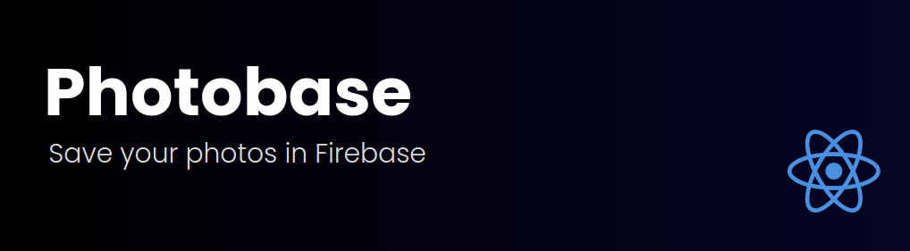
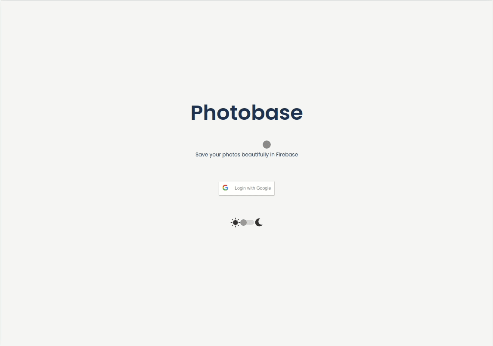
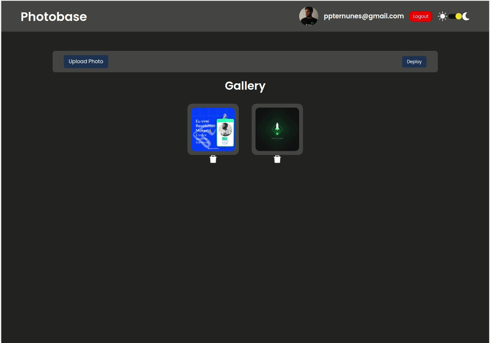
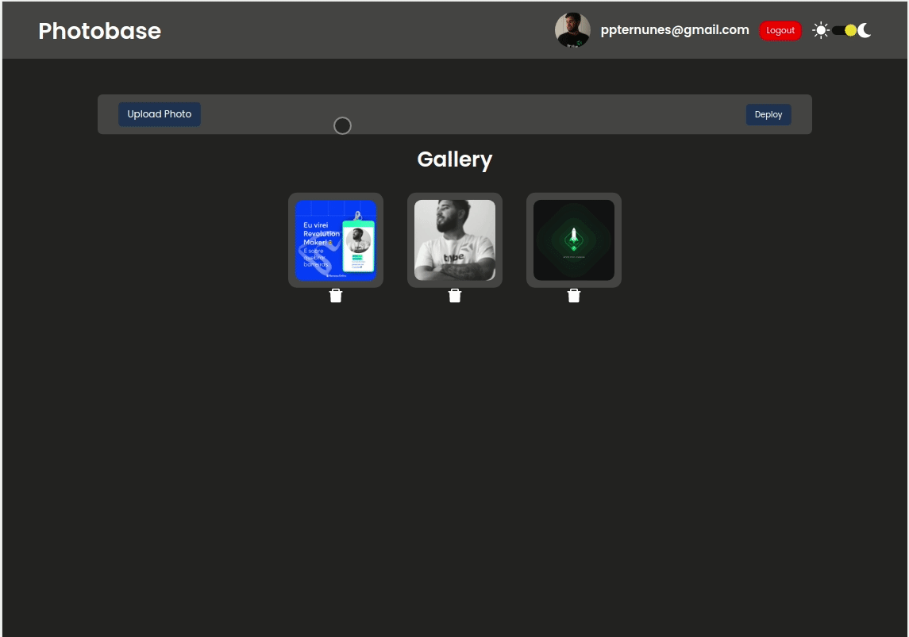

<br />

# :pushpin: Index
- [Project Media](#camera_flash-project-media)
- [About](#monocle_face-about)
- [Technologies](#rocket-technologies)
- [Installation](#hammer_and_wrench-installation-steps)
- [Author](#closed_book-author)
<br />

---

# :camera_flash: Project Media
Login - upload invalid photo


Upload valid photo


Modal photo - delete photo


<br />

---
# :monocle_face: About
Project designed to practice React integration with Firebase Storage and Google OAuth / Theme Switch.

To log into the application, react-google-login lib was used.
Data is persisted to Local Storage via useGoogleAuthInfo Hook.

To change themes, Styled Components Theme Context was used via useSwitchTheme Hook.

I hope you enjoy :D
<br />

---

# :rocket: Technologies
This project was developed with the following technologies: <br>
- :heavy_check_mark: **React**
- :heavy_check_mark: **Context API**
- :heavy_check_mark: **Hooks**
- :heavy_check_mark: **Styled Components**
- :heavy_check_mark: **TypeScript**
- :heavy_check_mark: **Firebase**
- :heavy_check_mark: **ESLint**
- :heavy_check_mark: **Prettier**
<br><br>
<br />

---

# :hammer_and_wrench: Installation Steps
**This project involves many .env files, be sure you have them!**

1. Clone the repository

```bash
git clone git@github.com:PatrickMoraisN/ignews.git
```

2. Change the working directory

```bash
cd ignews
```

3. Install dependencies

```bash
npm install
```

4. Create `.env.local` file in root and add your variables

```bash
# Stripe

STRIPE_API_KEY=YOUR_STRIPE_API_KEY
NEXT_PUBLIC_STRIPE_PUBLIC_KEY=YOUR_NEXT_PUBLIC_STRIPE_KEY
STRIPE_WEBHOOK=YOUR_STRIPE_WEBHOOK_SECRET

# Github

GITHUB_CLIENT_ID=YOUR_GITHUB_CLIEND_ID
GITHUB_CLIENT_SECRET=YOUR_GITHUB_CLIENT_SECRET

# FaunaDB

FAUNADB_KEY=YOUR_FAUNADB_KEY


# Prismic CMS 

PRISMIC_ENDPOINT=YOUR_PRISMIC_ENDPOINT
PRISMIC_ACCESS_TOKEN=YOUR_PRISMIC_ACCESS_TOKEN_ENV
```

5. Run the app

```bash
npm run dev
```

You are all set! Open [localhost:3000](http://localhost:3000/) to see the app.

---

# :closed_book: Author
Patrick Morais <br>
[](https://www.linkedin.com/in/patrick-morais/)<br>
[](mailto:ppternunes@gmail.com)<br>
[](https://www.github.com/patrickmoraisn/)